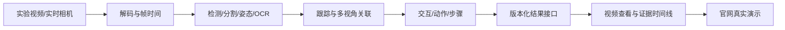

# 项目架构与目录

官网与算法系统共用明确的结果接口，数据准备和训练服务于真实视觉能力。当前已有静态官网源代码；下列算法目录表示模块归属，不能按目录存在声称功能已实现。

```text
LabPrism/
├── AGENTS.md / Agent.md       代理工作规范与入口
├── README.md                 项目总入口
├── LabPrism.code-workspace    编辑器工作区
├── apps/
│   ├── website/              官网：首页、技术页、演示入口
│   └── viewer/               连续视频、图层、器材详情、事件时间线
├── src/labprism/
│   ├── perception/           检测、实例/语义分割、手部姿态、OCR
│   ├── tracking/             器材/手身份、视频分割、时序关联
│   ├── understanding/        交互、动作定位、步骤分段、未知/异常
│   ├── geometry/             深度、3D、相机标定与多视角
│   └── runtime/              GPU/ONNX/NPU 适配、解码和调度
├── packages/contracts/       跨模块结果、数据和模型的版本化契约
├── evaluation/               产品/推理验收协议与入口；结果存运行根/NAS
├── configs/
│   ├── project.json          名称、根路径、预览及主线
│   ├── models/               分任务/视角的模型配置
│   ├── pipelines/            推理流程配置
│   └── deployment/           GPU 与具体 NPU 的部署配置
├── scripts/                  预览、项目检查及后续交付工具
├── tests/                    单元、集成和端到端验证
├── docs/                     排期、现状、接口、验收、数据与部署说明
└── data/README.md            指向外部数据位置；不存数据
```

## 运行流程



数据集、标注与训练在 AnnotationWorkbench 实施；LabPrism 提供任务需求、输出接口、质量目标，接收版本化推理权重和生产方回执，再做完整产品验收。训练内验证属于标注项目，真实视频的端到端性能、跨模块错误和部署验收属于 LabPrism。无需先完成自动抽帧、自训练或无人值守飞轮，才开始模型基线和网站演示开发。

```text
AnnotationWorkbench                         LabPrism
数据集 / 标注 / 训练 / 训练内验证  ──交付──→  推理权重接收 / 算法集成
原始标签、检查点与训练日志留存     ←─需求───  官网 / 视频产品 / 系统验收 / 部署
```

官网的通用介绍与模型真实推理结果分开记录。原图、离线结果和实时结果各有明确状态，前端不自行创造识别框、骨架和事件作为算法成绩。

## 模块结果最小约定

每批输出至少具备 `schema_version`、`task`、`model_version`、源标识/哈希、相机与角色、时间戳、原图尺寸、坐标系、结果和可用性状态。框、mask、关键点、轨迹、文字及事件的载荷使用对应任务版本；禁止混用未声明的坐标或未来帧信息。具体字段契约随第一个真实模块接入落定并测试。
