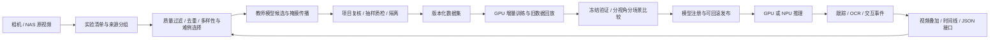

# 实验室视觉泛化项目：8 周实施与验收计划

版本：2026-09-17 / v1.2。计划窗口：2026-09-17 至 2026-11-11。

目标：建立从实验视频采集、实例识别与分割、视频跟踪、手与器材交互、仪表 OCR，到结果展示、数据回流、模型发布和部署的完整流程。中心 GPU 先完成可用版本；从第一周验证边缘 NPU 的可转换性。第 4 周交付端到端演示，第 8 周交付有跨场景测试证据的试用版本。

**追加目标：复现官网演示，并在实际使用中做得更好。** 将逐件彩色掩膜、连续跟踪、清晰器材名称、手部骨架、操作字幕与可回放时间线作为完整产品交付。以跨场景泛化、视频稳定性、OCR 联动、可追溯的数据飞轮和 GPU/NPU 部署作为改进方向；用测试证据区分展示复现、相对旧系统改善、相对对方性能优势。具体清单见 [官网演示复现与提升验收](TRANSFYR-REPRODUCTION-ACCEPTANCE.zh-CN.md)。

**完整能力要求：** 语义分割、实例/视频分割、目标检测、手部姿态及追踪、手—器材交互、动作/步骤理解、OCR、深度/3D、未知与异常、展示与部署分别建立任务、数据、模型和验收；详见 [完整视觉能力矩阵](LAB-VISION-CAPABILITY-MATRIX.zh-CN.md)。下述周计划与此矩阵共同执行；新增手部、语义等模块的基线工作提前到 W1–W2，不等到展示周才寻找模型。

这是实施计划和拟定验收目标，不是当前已达到的性能声明。“烧杯换一个地方仍是烧杯”优先于增加演示中的标签数量。8 周内按明确场景、类别和硬件交付，不能把有限测试解释为所有实验室、所有器材上的普遍可靠。

## 1. 参考演示与实际任务

已查看用户截图与 Transfyr 技术页播放中的演示。画面展示逐件器材的轮廓、细分类别、手部关键点，以及带时间区间的动作描述；技术页还讨论步骤、设备与环境信息。[Transfyr 技术页](https://www.transfyr.ai/technology)

| 参考能力 | 本项目对应交付 | 验证方式 |
| --- | --- | --- |
| 器材框、逐件彩色轮廓 | 目标检测与实例分割，同类多个烧杯分别有 mask 和 ID | 全画面漏检、误检、实例 mask AP，密集与遮挡场景单列 |
| 视频中的连续识别 | 单相机内跟踪、遮挡恢复、稳定标签 | IDF1、身份切换、静止目标标签跳变；连续视频测试 |
| 手部骨架与操作关系 | 手部关键点、手—器材关联，少量可观察动作 | 手套/裸手分开；事件区间和关联对象正确率 |
| 规格和设备名称 | 通用类别 + 有依据的规格/品牌属性 + OCR/资产绑定 | 不凭外形猜品牌、容量或试剂内容；属性可返回未知 |
| 动作字幕和时间线 | 结构化事件、证据帧、可回放时间线 | 事件 F1、时间区间、对应器材 ID 与原视频可追溯 |

演示核心之一是**实例分割**；语义分割为像素赋予类别，不能单独解决“分别追踪两个烧杯”。按用户追加要求，台面、操作区域及定义清楚的可见材料区域的语义分割进入同一计划，使用独立标签和指标。公开技术页没有给出足以核验其跨实验室准确率、处理延迟或全部自动化程度的数据；不能仅由演示反推其训练方法，也不能声称已达到其未公布的指标。

## 2. 已核验的起点

2026-09-17 工作台清单快照；不是全 NAS 逐文件盘点。证据随本计划交付在 `inventory.json`、`nas-intake-inventory.json`。

| 数据项目 / 视角 | 已登记图片 | 完整复核训练图 / 实例 | 完整复核验证图 | 主要缺口 |
| --- | ---: | ---: | ---: | --- |
| 实验器材 / 第一人称 | 3,331 | 63 / 897 | 16 | 烧杯仅 43 个训练实例；单支枪头仅 1 个 |
| 实验器材 / 第三人称 | 3,357 | 16 / 262 | 2 | 烧杯仅 3 个；类别与场景覆盖严重不均 |
| 面板检测 / 第一人称 | 3,303 | 137 / 223 | 12 | 当前固定模型验证仅 4 张完整画面，其余裁剪不能替代全景验证 |
| OCR / 第一人称 | 286 | 38 / 38 | 13 | 小数点、负号、设备 B 和新显示模式不足 |

实验器材合计 6,688 张，但可按完整复核契约训练的只有 79 张 / 1,159 个实例。图片数、自动候选数不能代替训练数据质量。当前“完整复核”是项目复核身份，不称为人工独立真值；本轮只做清单分析，没有重新逐图核验这些标签。

已登记 NAS 导入清单 528 份、543 条视频记录、466 个不同源视频路径，涉及 7 个相机 ID。重复路由记录不计为新的视频；相机数量不等于独立实验室数量。现有按日期分组保守防泄漏，但不足以描述实验台、人员、物理器材和实验批次。

硬件为单张 RTX 3090 Ti，约 24 GB 显存；NAS 此次检查约余 1.1 TB，本机约余 48 GB（后台归档运行中，空闲空间会变化）。预算先按现有硬件、不新增付费服务安排。共享 GPU 的其他任务保留，使用队列调度。容量数字是时点快照。

现有工具以框和文字行为主，尚无完整的实例掩膜、视频轨迹标注及导出链路。此前训练质量暂停继续有效；计划建立不等于解除暂停。现有采集、筛选与归档服务的运行状态，和本计划中的新分割模型训练状态分别报告。

## 3. 技术路线：教师模型、运行模型、部署接口



**教师端。** 优先试验 SAM 3.1 的文本提示、实例分割与多目标视频跟踪，用于提议标签和建立离线效果对照。官方已发布多目标共享处理的 3.1 版本；它不自动解决本项目的类别歧义、漏标或玻璃边界问题。[SAM 3.1 发布说明](https://github.com/facebookresearch/sam3/blob/main/RELEASE_SAM3p1.md)

先用 30–50 张覆盖两种视角的训练候选和短视频测显存、速度、漏检与 mask 可修正成本。官方依赖和当前运行环境不同，另建教师环境，不原地升级现用队列。权重访问、许可或 24 GB 显存不适合时，使用 Grounding DINO + SAM 2.1 的框到掩膜/视频传播方案继续推进，不等待单一模型。[SAM 3](https://github.com/facebookresearch/sam3)、[Grounding DINO](https://github.com/IDEA-Research/GroundingDINO)、[SAM 2](https://github.com/facebookresearch/sam2)

**运行端。** 保留现用检测器作为基线；GPU 候选比较 YOLO26-seg 的小/中型版本与便于边缘转换的 YOLOv8-seg。根据本地数据的精度、延迟、标注成本和可转换性选型，而不是按模型发布日期选胜者。模型代码、权重和数据分别登记许可；Ultralytics 的开源/商业许可选项在产品交付前明确。[实例分割文档](https://docs.ultralytics.com/tasks/segment/)、[YOLO26](https://docs.ultralytics.com/models/yolo26/)

**训练连续性。** 每个项目、任务、第一/第三人称保留独立的数据版本、父权重和晋级状态。相同结构的新一轮继承最近通过验证的模型，混入旧场景回放；失败候选不作为下一轮父模型。首次新增分割头或更换架构需要显式的迁移初始化记录，不能把框检测权重的部分加载称为完整恢复分割训练。训练优先 CUDA、AMP、batch 16；显存和吞吐允许时升到 32。若目标分辨率下必须减小实际 batch，记录实际 batch 与梯度累积后的有效 batch，不伪报 batch 32，也不通过降低质量强求满显存。

**跟踪与动作。** 先做 ByteTrack 等轻量跟踪基线，实例 mask 与 track ID 对齐；复杂遮挡用离线教师传播协助标注。手部关键点模型先测戴手套的域差异；关键点不稳时保留手框/掩膜和不确定状态。只有证据足够才形成拿取、放置、接近、移开等可观察事件，逐步增加倾倒/移液相关操作；重叠不能直接证明接触，动作不能证明真实转移体积。[ByteTrack](https://github.com/FoundationVision/ByteTrack)

**OCR 单独演进。** `field-panels-mvp-v1` 负责显示区域，`field-ocr-readout-v1` 负责逐字识别；仍单独训练、验证和发布。读取数字时保留正负号、小数点、单位及原始裁剪证据。器材分类、面板识别、OCR、动作四类结果在应用接口汇合，权重和指标不混为一个总分。

## 4. 数据如何真正支持泛化

### 4.1 先定义类别与来源

保留 `visioncortex-lab-v1` 的 23 类稳定 ID，不覆盖历史标注。新 mask / track 数据使用版本化 schema 与导出契约，记录旧框标签的来源和映射。需要调整层级或属性时写显式迁移映射，不重新解释历史 class ID。

每条素材至少记录：源文件 SHA256、实验 session、实验室/实验台、相机 ID、第一/第三人称、拍摄日期、视频时间戳、物理器材 ID/型号族（可未知）、人员匿名标识（可未知）、来源组、父图/裁剪关系、许可、标注版本、复核身份。未知场景或器材元数据不自动补猜；未知角色不进入要求已知角色的训练导出。

**烧杯专项验证矩阵：** 不同实验台与背景、不同实物/规格、空杯与有内容物、不同方向和距离、手持遮挡、透明反光、光照变化、第一/第三人称；加入锥形瓶、量筒、普通杯、试剂瓶等混淆物。新测试需要留出未见过的物理烧杯和环境；把同一个烧杯移动几厘米不计为新的器材泛化证据。

### 4.2 抽帧策略与量级

优先选择器材/手进入退出、操作变化、模型分歧、稀缺类、新视角和新背景；设最低清晰度与曝光要求，再做时序及跨视频去重。保持少量新颖场景探索和经过核验的负样本，避免只保留旧模型认识的目标；大批静态桌面、暗帧、模糊帧不进入常规标注队列。负样本必须核验确实没有目标，不能将“模型没检出”当成负标签。

第一周完成 200–300 张有代表性候选的筛选及首批 50 张标注耗时试验。第 4 周争取 500–800 张有效训练帧；第 8 周争取累计 1,000–2,000 张有效训练帧、200–300 张验证帧、300–500 张封存测试帧，并准备 20–30 段来自不同实验的测试片段。它们是工作量估算，不是按数量自动放行的门槛；密集 mask 的真实修正耗时在第一周测量后更新排期。

相邻视频帧及自动传播的 mask 不当成等量独立标注。优先提升 8–12 个核心器材类别与两种视角的覆盖，23 类全部保留统计；低样本类别明确显示证据不足。实验员如能每周配合 2–3 次、每次 10–15 分钟的针对性补拍和器材辨认，可降低数据缺口；不假定已有专职标注人员。只凭当前 NAS，如果没有外部实验室素材，就只能验证跨实验台/相机，不能写成跨实验室通过。

### 4.3 公开数据的有界使用

| 数据来源 | 适用用途 | 已核验情况与处理 |
| --- | --- | --- |
| 自有 NAS 每日/历史实验 | 本项目类别、场景、视频与 OCR 主数据 | 只读源视频；按缺口取材；实验批次与近重复同组 |
| Annotated Chemical Apparatus Image Dataset | 补充器材外观与检测预训练 | 官方数据页列 5,078 张、六类器材及手、YOLO 框、CC BY 4.0；先核对类别、完整标注范围和来源分组，保留署名与原始分区 |
| Vector-LabPics | 透明容器及材料区域研究参考 | V1 官方明确商业/非学术使用需原图片权利人许可；当前不直接纳入产品训练集。V2 另行核验，不能继承代码许可 |
| EgoExoLearn | 第一/第三人称操作过程与动作表征研究候选 | 官方研究包括实验任务；视角为异步示范/执行，不是同一实验的同步多机位真值。数据授权待核验，不能从代码 MIT 推断视频许可 |

来源：[化学器材数据集](https://data.mendeley.com/datasets/8p2hvgdvpn/1)、[Vector-LabPics V1](https://zenodo.org/records/3697452)、[EgoExoLearn](https://egoexolearn.github.io/)、[EgoExoLearn 论文](https://openaccess.thecvf.com/content/CVPR2024/papers/Huang_EgoExoLearn_A_Dataset_for_Bridging_Asynchronous_Ego-_and_Exo-centric_View_CVPR_2024_paper.pdf)。本轮没有下载、导入或训练公开数据。

公开数据只标部分器材时，不能把剩余可见目标当背景；先补全或使用经验证的 ignore/部分监督训练契约。不按名称直接合并玻璃移液管与当前移液枪类。公开测试图片可能已被基础模型预训练见过，因此最终泛化证据优先来自封存的自有新实验。

### 4.4 自动标注的质量控制

1. 教师输出永远先是候选；模型高置信度不等于正确，不自动改成完整复核标签。
2. 每类/每视角抽查漏标、误分类、边界、遮挡、密集实例与新场景。以每批至少 20 张或 10%（取较大值、最多整批）作为启动抽检预算；发现系统性错误扩大检查或隔离批次，不能用一两个正确框放行整幅画面。
3. 对可进入完整监督的数据，实际查看全图并处理所有可辨认实例；不清晰或未解决区域保留。玻璃器材采用可辨认的外轮廓作为实例范围，透明内部包含在器材轮廓内；可见遮挡物不补画为器材，是否标液体另立任务。用样例冻结规范后统一执行。
4. 有条件使用伪标签时保留其身份、权重和来源。先验证漏标保护与 mask ignore 的损失实现，再用少量伪标签（初始上限占训练采样 20%）做有/无伪标签对照；未通过不能恢复无人值守自训练。
5. 项目复核与模型自动提议分开；只有由另一名标注者独立核验才报告独立复核。单一教师或同一代理重复查看不改称独立真值。

训练/验证/测试按实验来源组先划分，再抽帧、裁剪或增强。相同源实验的不同相机、重复像素、派生图不能跨分区；已有分区记录保留。新基准若需重组，建立显式版本并隔离旧模型的训练暴露。阈值和策略在验证集确定，最终测试集封存至末期，禁止看完测试错误再调参后用同一测试宣称泛化通过。

## 5. 八周排期与交付

依赖顺序：可信来源/测试设计 → mask 工具与教师试验 → 有效标注 → 学生训练 → 视频闭环 → 泛化与部署验收。NPU 转换试验从第一周进入关键路径。

| 周期 | 重点工作 | 周末应当看到的交付 |
| --- | --- | --- |
| W1 · 9/17–9/23 | NAS 来源和类别覆盖盘点；实验/实物分组；烧杯专项测试设计；首批质量筛选和 50 图耗时试验；检测/手部/语义基线、NPU 转换探路与 3D 输入盘点 | 数据缺口矩阵、冻结的基准规则、真实错误样例、第一版硬件/转换记录；本周可实现吞吐据此定标 |
| W2 · 9/24–9/30 | 实例/语义 mask、手关键点与 track 数据契约、CLI/API/界面及导出；教师方案对照；小型模型试训；补第一/第三人称；几何路线小试 | 可查看、修正、导出的轮廓与关键点；教师误差报告；各模块基线及 ONNX 一致性报告 |
| W3 · 10/1–10/7 | 核心类别与烧杯跨背景/实物补齐；透明/遮挡难例；独立视角学生训练；手部/语义模型候选改进；旧数据回放 | 第一/第三人称及各任务候选模型、同一验证集的逐类/逐场景比较、完整数据与父模型回执 |
| W4 · 10/8–10/14 | 接通视频输入、实例/语义 mask、手部骨架初版、跟踪和结果接口；逐帧、原画对照、图层开关、标签避让与实例详情；延迟与断流恢复；NAS 发布 v0.1 | 至少 3 段完整未剪辑的新实验视频演示；可操作的视频界面和端到端 GPU 版本；暂未达标类别与模块清单 |
| W5 · 10/15–10/21 | 手部关键点与 5–8 种候选交互事件；OCR 小数/负号覆盖；时间线与证据帧 | 器材、手、读数、动作在同一视频时间轴展示；证据不足的事件明确不确定 |
| W6 · 10/22–10/28 | 飞轮批次质检、候选/现用模型自动比较、发布/回滚；NPU 量化与前后处理适配 | 每轮可解释的入库/拒绝/训练/晋级记录；CPU/ONNX/NPU 数值对齐与量化损失报告 |
| W7 · 10/29–11/4 | 新采集环境的预验收（使用开发验证集）；多路吞吐与长时间运行；有板卡时真机 NPU 测试 | 环境与硬件分层结果、连续运行记录、主要失败场景修复；冻结最终候选与阈值 |
| W8 · 11/5–11/11 | 封存测试一次验收；完整视频盲测；官网演示复现逐项对照；NAS 数据/权重/部署包；操作与回滚说明 | v1.0 试用交付、复现清单与改进证据、逐项达标/未达标/无法同条件比较报告、实物泛化证据和后续难例清单 |

W4 交付目标为核心类别的完整视频流程、语义图层和手部骨架初版；后半程完善姿态稳定性、交互/步骤理解与有依据的品牌型号识别。W8 若个别类别、模块或 NPU 尚未达标，交付实际结果与明确缺口，不修改验收口径或把桌面 GPU 运行冒充板上部署。各能力持续保留在清单中，超出单卡与标注产能的项目给出有依据的后续工期。

## 6. 验收目标与防退化规则

下表数值为**拟定目标**，不是当前成绩。W1–W2 在训练/开发验证集上确认样本规模、标注规范、硬件和实际任务难度，再冻结基准 v1。变更阈值必须记录理由和版本，不能依据封存测试结果降低标准。

| 项目 | 建议目标 | 计量条件与限制 |
| --- | --- | --- |
| 烧杯新场景检测 | Precision ≥95%，Recall ≥90% | box IoU ≥0.5，一对一匹配；两种视角分别报告；阈值在 val 选择，test 固定 |
| 核心器材识别 | 每个核心类 Precision ≥90%，Recall ≥85% | 报 23 类完整表、宏平均及样本量，不用大类平均掩盖长尾；小目标/遮挡单列 |
| 实例分割 | 核心类 mask AP50 ≥80%，AP50:95 ≥50% | 使用全画面 COCO 匹配，漏检和多余 mask 都计入；透明与密集场景另报 |
| 语义分割 | mIoU、逐类 IoU 与边界 F1；数值门槛在 W1–W2 基准小试后冻结 | 独立语义类表、真值与 ignore；低样本/大面积背景不掩盖目标区域错误 |
| 手部姿态与追踪 | 21 点 PCK/AUC、左右手错误、失踪/切换、抖动；数值门槛在 W1–W2 冻结 | 手套/裸手、双手交叉、器材遮挡、两种视角分别测；检测失败计入端到端结果 |
| 跨场景稳定性 | 新场景核心类 Recall 较可比已知场景下降 ≤10 个百分点 | 同一阈值；同时达到绝对精度目标；若样本或环境不可比则报告不可判定 |
| 跟踪 | IDF1 ≥80% 的试用目标 | 两视角分别测；测试短片有轨迹真值；报告遮挡、身份切换和延迟 |
| OCR | 可读样本整行准确率 ≥95% 的试用目标 | 正负号、小数点、单位均逐字符计错；清晰/模糊、设备 A/B 分层；不可读另报拒识质量 |
| 少量操作事件 | event F1 ≥80% 的试用目标 | 5–8 类候选中仅发布通过的类别；事件一对一匹配、时间 IoU ≥0.5，核对器材关联 |
| 中心 GPU | 单路 720p 输入、≥15 FPS、端到端 p95 ≤200 ms 的初始目标 | 包含解码、推理、mask、跟踪、序列化；网络/显示延迟另记；多路容量另测，不能由模型 FPS 相乘 |
| NPU | 首先验证正确转换；目标 INT8 较 FP16 核心检测指标下降 ≤2 个百分点、mask AP 下降 ≤3 个百分点 | 实板型号确定后冻结 FPS/功耗/温升指标；未上板只报告转换准备完成 |

每个核心类别/视角的最终测试争取至少 50 个可评实例、来自至少 5 个独立实验来源组；烧杯应含多件未参与训练的实物。未满足时显示“证据不足”，不能勾选通过。采用按实验组重采样的置信区间，报告实际分母；相邻帧不能当作大量独立证据。既有旧模型参与过训练的数据，不可作为该模型的“未见场景”测试。

持续晋级使用开发验证集和回归集，最终测试另封存。新模型需要满足绝对质量门槛、核心类/每视角无明显回退（初始警戒为关键指标下降超过 2 个百分点）、数据无泄漏、推理耗时与部署一致性合格。边界差异和小样本须复核，不能只看总体 mAP 上升。只有候选通过才更新该项目/任务/视角的 current；失败继续保留旧版本，并记录拒绝理由。

## 7. NPU 从现在开始准备

先确认最终板卡型号、SDK/驱动、RAM、视频解码能力与内存带宽。NAS 清单中的 RK3588 相机名称只提供选型线索，不证明已获得可用于部署的 NPU 环境。若采用 RK3588，Rockchip 官方模型库已有 YOLOv8 分割和 OCR 等转换示例，可作为可部署基线；不能据此推断所有新架构均支持。[RKNN Model Zoo](https://github.com/airockchip/rknn_model_zoo)

W1/W2 就验证静态输入、ONNX 算子、预处理、NMS、mask 原型后处理与输出 ABI。W6 使用只来自训练分区的代表性素材校准 INT8，覆盖透明玻璃、小物件、两种视角、暗光；验证/测试不用于量化校准。对相同输入逐层比较 PyTorch、ONNX 和板上结果。

边缘端先承担视频解码、轻量检测/分割与跟踪，OCR 按 ROI/事件触发；复杂离线教师和较重的动作分析可留中心 GPU。mask 解码、最大实例数、CPU 后处理与数据传输可能成为瓶颈，必须计入完整延迟。板上交付包括 SDK/固件适配、模型、前后处理、启动配置、资源监测、热稳定测试、版本回滚，不以一个 `.onnx` 文件代替部署完成。

目前尚未指定 NPU 型号，不据此承诺 NPU 帧率或购买硬件。主链 GPU 交付继续推进，转换契约与测试留好，确认板卡后补真机验收。

## 8. NAS 交付结构与工程边界

NAS 归属根：`/mnt/realityloop-nas/AnnotationWorkbench/`。本轮计划和证据实际位于 `programs/lab-vision-generalization-v1/`；以下为各阶段交付逻辑结构，未产生的训练/部署文件不会用空目录冒充完成。

```text
AnnotationWorkbench/
  programs/lab-vision-generalization-v1/
    README.zh-CN.md             本轮实际状态与入口
    plan.zh-CN.md               本排期
    backlog.json               依赖、状态、验收与证据
    inventory.json             项目与类别覆盖快照
    nas-intake-inventory.json   NAS 导入来源快照
    coverage.zh-CN.md           首轮覆盖缺口
    sources.json               数据/模型来源及许可待办
    delivery-receipt.json       本轮文件的真实字节哈希
  datasets/<project>/<task>/<view>/<release>/
    images/                    可携带的自有图片字节
    annotations/               COCO instances / OCR / tracks
    splits/                    来源组与样本清单
    manifest.json              schema、class map、许可、来源、哈希
    quality-report.json        完整性、抽检、分区检查
    READY.json                 校验完成后发布
  models/<project>/<task>/<view>/<release>/
    weights/                   best、last、父权重引用及哈希
    metrics/                   逐类、逐视角、逐场景、延迟
    training/                  配置、日志、环境、数据版本、初始化方式
    model-card.json            能力范围、限制、谱系、许可、晋级结论
  deployments/<project>/<task>/<view>/<release>/<backend>/
    model/                     ONNX / RKNN 等真实文件
    runtime/                   启动、前后处理、SDK 依赖
    validation/                转换一致性、量化损失、实板测量
    rollback.md
  evaluations/<benchmark>/<release>/
    report.json                固定基准与候选比较
    videos/                    未剪辑演示与叠加结果
    errors/                    失败案例及证据
```

每个运行结果带 `session_id`、`camera_id`、`view_role`、视频时间戳/帧 ID、`model_version`、class、bbox、mask、置信度、track ID；OCR 与动作有自己的模型版本、时间区间及证据引用。多相机时钟与物理实体关联另有明确校准，否则只保证单相机 track ID。

以上任务层级是新发布契约目标；已交付的历史 NAS 布局、项目 ID、模型和审计不移动或覆盖。未来目录适配需迁移回执。热缓存与 SQLite 留本地，持久数据/权重/完整结果存 NAS，发布前检查挂载与卷身份。源视频只读，训练缓存有上限；不把图片、数据库、权重和导出提交 Git。

AnnotationWorkbench 负责自有采集、标注、训练、模型评测与独立演示/推理接口。与 VisionCortex、FieldRecognition 等消费系统通过版本化数据、模型和接口回执连接；实际业务端修改与部署在相应项目中实施，不从当前仓库暗中启动或改写消费项目。完整链路的独立演示可先在本项目验证。完整项目边界见代码仓库 `docs/PROJECT-BOUNDARY.zh-CN.md`。

## 9. 推进方式与当前完成边界

本轮已完成：官网能力分析、当前标签/类别覆盖清单、NAS 已登记来源盘点、公开数据与模型候选核验、8 周排期和验收建议。尚未完成：新分割标注、教师试验、模型训练、跨场景精度验收、NPU 转换及部署。原有框检测/OCR 权重保留；不能作为本轮新训练交付。

下一步按 `backlog.json` 的依赖推进 W1：先冻结基准元数据和缺口取样规则，再准备代表性候选、实际看图复核及教师/部署小试。训练恢复必须完成对应项目的质量恢复条件，不能为了赶日期取消已有保护。

计划推进依赖机器、NAS、GPU 和任务运行额度可用。数据难度与标注产能在第一周用实测校正；如需额外硬件、付费服务或额外人员，先给出具体收益和费用，不假定新增预算。每天的工作记录保留可检查的产物和证据，里程碑以验收通过记完成，不能以到达日历日期自动完成。

已创建当前任务的持续推进安排：每天 09:30（Asia/Shanghai）继续一个按依赖可执行的步骤，计划截止 2026-11-11；有实质结果或具体阻塞才通知。它负责继续工程与复核工作，实际视频处理/训练仍由可记录状态的本地任务执行，不意味着全天持续占用 GPU。定时本地任务需要机器开机、应用运行且目录可用。[定时任务运行说明](https://learn.chatgpt.com/docs/automations?surface=app)
